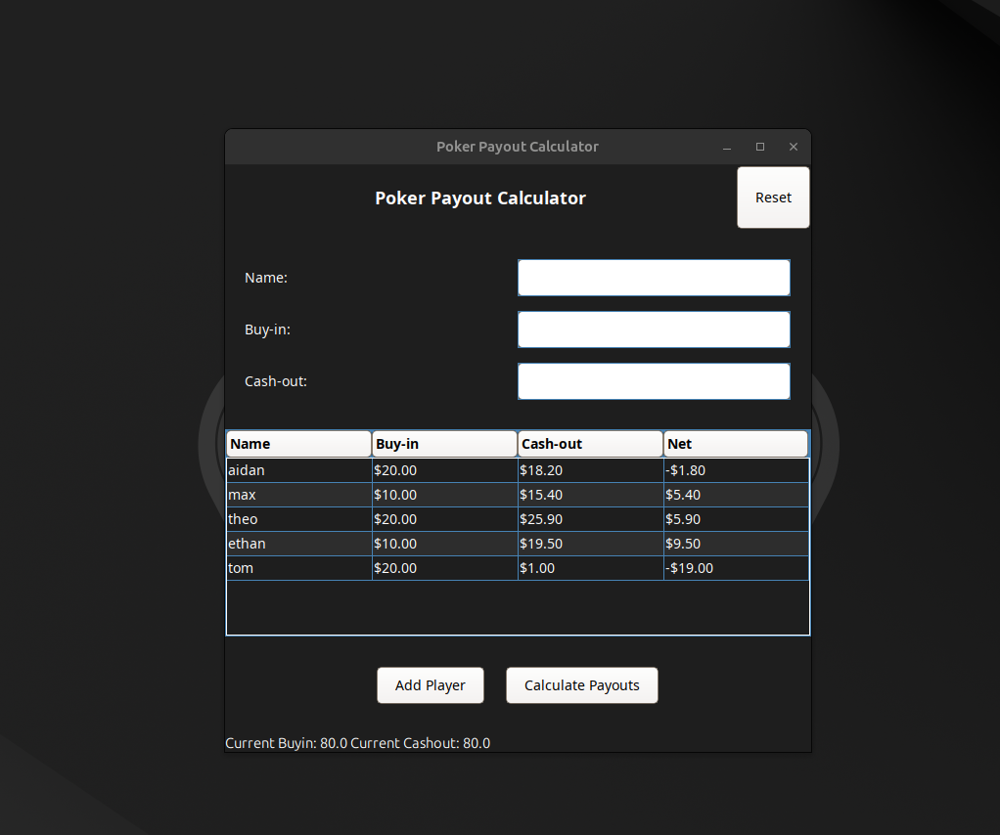

# Poker Home Game Payout App

It is always frustrating when you play a poker game that requires one player to act as the banker. This app removes the need for a middleman and allows friends to settle up in the least amount of transactions possible! Similar to Splitwise!

Please download from releases and enjoy!

[Releases](https://github.com/aidanalr/homegamepayoutapp/releases)

## About this Project

This project was generated using the Swing project template from [jDeploy](https://www.jdeploy.com), a tool to deploy Java desktop apps on Windows, Mac.
